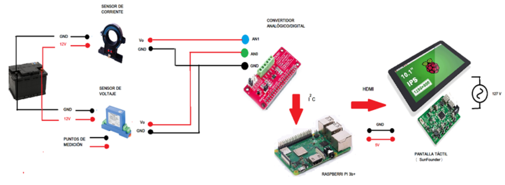

# EVDAQ

Se describe el proceso de diseño, selección de componentes y
construcción de un sistema de adquisición de datos (DAQ) de bajo costo y de prestaciones
comparables a sistemas comerciales, a partir del uso de un micro ordenador
Raspberry PI 3b+, que permite la obtención de parámetros de voltaje, corriente y
potencia eléctrica generados por la batería de un vehículo equipado con un motor
eléctrico. La información obtenida se utiliza para determinar el rendimiento de un
vehículo eléctrico.
El procedimiento incluyó la integración de los componentes del sistema, la configuración 
del software del sistema y el desarrollo del software de adquisición de datos.
El sistema prototipo se probó en condiciones de laboratorio, utilizando un dinamó-
metro de chasis para la evaluación de consumo energético para cumplir un ciclo de
conducción NEDC (New European Driving Cycle).
La información obtenida por el sistema desarrollado se comparó con mediciones
tomadas por un sistema de adquisición de datos comercial Sirius Dewesoft XHS,
teniendo un error en medición menor al 1 %.

## Componentes Seleccionados

### Microcontrolador/Microprocesador

El ordenador seleccionado fue Raspberry PI 3B+, permite la creación de un sistema
de cómputo embebido debido a su micro procesador, con la capacidad de adquirir
señales sin necesidad de alguna tarjeta DAQ adicional y procesar los datos para las
pruebas de obtención de corriente, voltaje y potencia eléctrica de un vehículo eléctrico,
es un sistema económico y de fácil acceso, una desventaja es que no tiene entradas
analógicas pero se resuelve con un módulo externo.
Raspberry PI cuenta con la opción de utilizar un sistema operativo Raspbian, el
cual permite realizar multitareas como un ordenador convencional y para la creación
de la aplicación de control emplea lenguaje de programación Phyton con una variedad
de opciones disponibles en librerías. La placa tiene un procesador potente que
trabaja a 1.4 Ghz, y además elimina el cuello de botella de la conectividad incluyendo
Bluetooth 4.2, BLE, Wi-Fi a doble banda 2.4 Ghz y 5 Ghz y, además, la tarjeta de
red, Gigabit Ethernet, es capaz de alcanzar los 300 Mbps al funcionar sobre USB 2.0 1.

La placa cuenta con cuatro puertos USB 2.0, el puerto RJ45 para conexiones
Ethernet, la toma de auriculares, el conector HDMI, el puerto MicroUSB para la
alimentación o el ya clásico puerto GPIO.
A continuación, se detalla todas las características del modelo:
- CPU + GPU: Broadcom BCM2837B0, Cortex-A53 (ARMv8) 64-bit SoC @1.4GHz.
- RAM: 1GB LPDDR2 SDRAM.
- Wi-Fi + Bluetooth: 2.4GHz y 5GHz IEEE 802.11.b/g/n/ac, Bluetooth 4.2, BLE.
- Ethernet: Gigabit Ethernet sobre USB 2.0 (300 Mbps).
- GPIO de 40 pines.
- HDMI.
- 4 puertos USB 2.0.
- Puerto CSI para conectar una cámara.
- Puerto DSI para conectar una pantalla táctil.
- Salida de audio estéreo y vídeo compuesto.
- Micro-SD.
- Power-over-Ethernet (PoE).

De manera adicional, la tarjeta Raspberry Pi 3B+ ha sido usado en el desarrollo de
proyectos de medición automotriz, como menciona (2) el micro ordenador es capaz
de recibir más de una señal, procesarla y presentar resultados favorables con 2% de
error en las mediciones con respecto a sistemas especializados y de alto costo. Además,
cuenta con una variedad de puertos de entrada y salida necesarios para un sistema
de adquisición de datos.

### Convertidor analógico/digital

Para resolver la limitación de la tarjeta Raspberry Pi para la dquisición de señales
analógicas se decidió emplear un módulo convertidor analógio/digital externo que no
requiera adaptaciones adicionales para la conexión con la placa Raspberry, con el objetivo
de que los componentes del sistema sean compatibles entre si, se escogió el convertidor
analógico/digital RPi-ADS1115-ADC, fabricado especificamente
para trabajar en conjunto con la placa Raspberry Pi y en cuestión de programación
existe una librería en Phyton que permite el control de las entradas analógicas.
El módulo RPi-ADS1115-ADC es un convertidor de señales analógicas a digitales
(ADC) de precisión. El chip ADS1115 que proporciona una precisión de muestreo de
16 bits en un paquete MSOP-10, el mismo valor de resolución tiene el convertidor
analógico/digital en el sistema de adquisición de datos Sirius Dewesoft, por lo cual es
una medida sufriente para el sistema EV DAQ.
Los datos se transmiten a través de la interfaz en serie compatible con el protocolo
de comunicación I2C C. Tiene 4 direcciones I2C C para elegir y la fuente de
alimentación que funciona solo necesita 3.3V. Su función principal es detectar señales
analógicas y convertirlas en señales digitales.
Con respecto a la frecuencia de muestreo se tomó en cuenta el Teorema de Nyquist,
en donde la frecuencia de la señal es de 110 Hz y la frecuencia de muestreo del ADC
supera el requerimiento de ser por lo menos el doble de la señal.

### Pantalla para Raspberry Pi

Una parte importante del presente proyecto es disminuir el tiempo y la complejidad
al momento de instalar los equipos de medición, que comúnmente constan un
sistema DAQ, computador y sus respectivos periféricos de entrada como mouse, teclado
y una pantalla como periférico de salida. Con estos antecedentes se seleccionó
una pantalla táctil de la marca SunFounder, que tiene un alto nivel
de compatibilidad con el ordenador Raspberry.
La función táctil de la pantalla permite el movimiento y control de aplicaciones
sin utilizar elementos adicionales, de igual forma con la opción de teclado en pantalla
ya no es necesario uno físico.
La pantalla SunFounder de 10.1¨ es un monitor táctil capacitivo de 5 puntos,
con una resolución de 1280x800, Funciona con varios sistemas operativos incluyendo
Raspbian, Ubuntu, Ubuntu Mate, Windows, Android.
Las características de la pantalla son:
- Resolución: 1280x800
- Fuente de energía: DC 12V/1,5A
- Consumo de energía: 4W
- Tipo de LCD: IPS

Por su alto nivel de compatibilidad con Raspberry PI, permite que en su estructura se
pueda comunicar fácilmente. Un puerto HDMI permite compartir multimedia en alta
definición, también el circuito que controla la pantalla transmite la energía necesaria
para alimentar la placa Raspberry, mediante un cable USB.

### Sensor de voltaje

Es un sensor de voltaje Jujie GT-D2U, tiene aislamiento magnético,
que proporciona una alta tasa de conversión de valores medidos entre 0V a 500 V y
datos entregados de 0 a 5 Voltios.
La capacidad de procesamiento y reacción de la placa de circuito son
elevadas, cuenta con características que protegen el sensor de condiciones de humedad
y polvo, por lo cual alarga la vida útil de los componentes y mejora la estabilidad en
las mediciones.
De acuerdo con las características de este sensor, es importante resaltar el rango de
medición que va de 0 a 500 voltios, lo que permite ser utilizado en una gama amplia
de vehículos eléctricos.
El transformador utiliza el principio de inducción electromagnética, es decir, al
bobinado primario ingresa el valor medido por el sensor (0V- 500V), se genera un 
flujo magnético, el cual viaja hasta el bobinado secundario. El movimiento producido
generará una fuerza magnética en el bobinado secundario, este valor es proporcional
a la entrada, ahora con una escala que va de 0V a 5V, que entra en el rango permitido
para ser leído por el convertidor ADC colocado en el ordenador Raspberry PI.

### Sensor de corriente

Es un sensor de corriente de núcleo divido, construido por FuChuang Tech, modelo
D-C3T. Utiliza el principio de medición de efectoHall. El sensor va montado en el 
hueco de un núcleo magnético. La salida del sensor se amplifica y mide el campo magnético 
creado por la corriente sin hacer contacto con ella, lo que produce un aislamiento 
galvánico entre el circuito y el sensor.
Para la selección del sensor D-C3T se consideraron varios factores, el principal es
el rango amplio de medición que ofrece, el cual va de 0A hasta 1000A y que a la salida
entrega un voltaje de 0V a 5V que es proporcional al valor tomado por el sensor. En
el cuadro 4.3 se muestran las características principales del sensor de corriente.
El sensor cuenta con 4 pines de conexión, los dos primeros de izquierda a derecha son 
los encargados de alimentar al dispositivo utilizando un voltaje de 12V, disponible en 
la batería del mismo valor que se encuentra en el vehículo.
El pin 3 lleva la información en un valor de voltaje hacia el convertidor analógico/-
digital, de igual forma el pin 4 (GND) se conecta con el puerto GND del convertidor.

## Integración de componentes

Para el desarrollo del sistema de adquisición de datos se realizó una selección de
diferentes componentes, los cuales se han descrito anteriormente. Los elementos seleccionados
cumplen con los requisitos propuestos de forma individual, a continuación,
se describe la forma de interacción que tienen entre sí, los protocolos de comunicación
y adaptaciones realizadas.
El proceso de comunicación empieza entre los sensores de corriente y voltaje con
el convertidor analógico digital y se nombró Etapa 1
se describió las características de cada sensor utilizado,
en donde se específica que el voltaje de alimentación requerido son 12V, por lo cual se
utilizó la energía que entrega la batería convencional de 12V disponible en la mayoría
de vehículos. Los sensores recopilan la información de corriente y voltaje, y estos datos
son enviados al convertidor analógico/digital mediante dos cables flexibles de calibre
14, uno lleva la información en voltaje de 0V a 5V a una entrada analógica del ADC, la señal del sensor de voltaje se conecta a la entrada AN0 y el sensor de corriente al puerto AN1 y el otro cable de cada uno al
puerto GND del mismo convertidor.
Al convertidor llega la información en forma de una señal analógica y entrega una
señal digital al procesador Raspberry PI, el traslado de datos se da al conectar el ADC
a los puertos de entrada y salida de propósito general de la placa Raspberry PI, la interacción entre los dos dispositivos se da mediante el protocolo de comunicación I2C. A la unión de dichos elementos se
denominó Etapa 2.
La etapa 3 de comunicación se da entre el ordenador Raspberry PI y la pantalla
touch SunFouder. El proceso de obtención de datos es controlado por
la aplicación para poder monitorear el proceso el sistema
utiliza la pantalla SunFounder que se comunica con la placa Raspberry PI mediante
un cable HDMI, que permite el uso de video digital de alta definición.
Otra conexión que tiene la placa Raspberry con la pantalla es la alimentación,
pues mediante un cable USB de 5V el circuito que controla la pantalla energiza al
ordenador.

